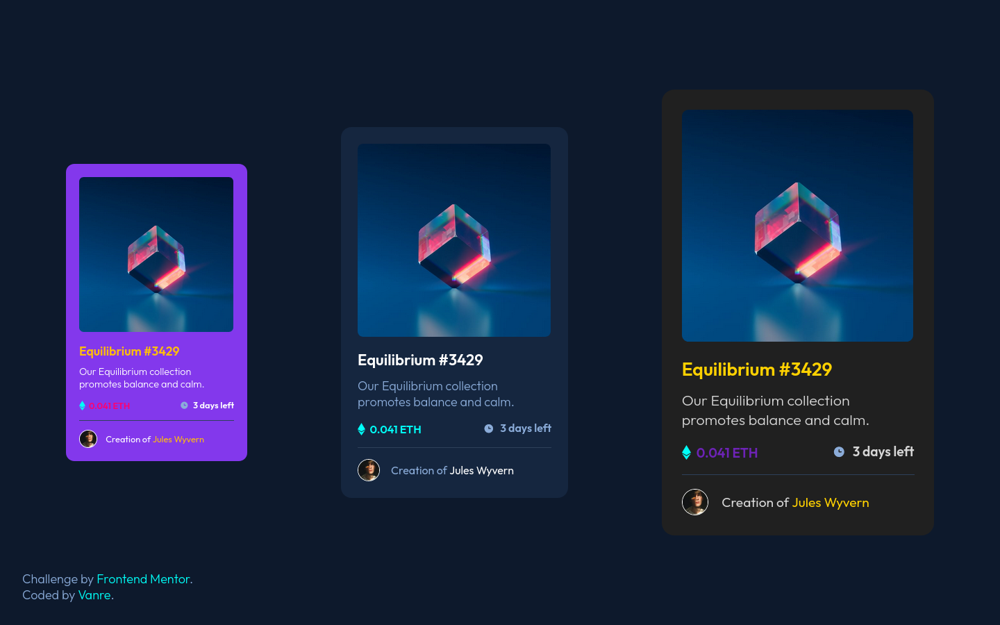

# Frontend Mentor - NFT preview card component solution

This is a solution to the [NFT preview card component challenge on Frontend Mentor](https://www.frontendmentor.io/challenges/nft-preview-card-component-SbdUL_w0U). Frontend Mentor challenges help you improve your coding skills by building realistic projects. 
In this solution I tried to make reusable components using CSS variables. 

## Overview

### The challenge

Users should be able to:

- View the optimal layout depending on their device's screen size
- See hover states for interactive elements

### Solution Screenshot




### Links

- Live Site URL: [Live solution](https://justinvanre.github.io/NFT-card/)

## My process

### Built with

- HTML/CSS
- CSS variables


### Self reflection 

Surprisingly the price section was pretty rough regarding aligning. I tried Flexbox and table-cell both didn't work out. I came to realize there was some spacing within the I tag. Maybe, If I'd set the line height to zero, it would've worked out. However, I've resolved it using position relative, but I'm not sure if that's the best way to do it. 

```css
.card i {
    position: relative;
}

.icon-ethereum {
    color: rgb(var(--color-hover));
    top: .165em;
    margin-right: .405em;
}
```

## Author

- Frontend Mentor - [@justinvanre](https://www.frontendmentor.io/profile/justinvanre)

